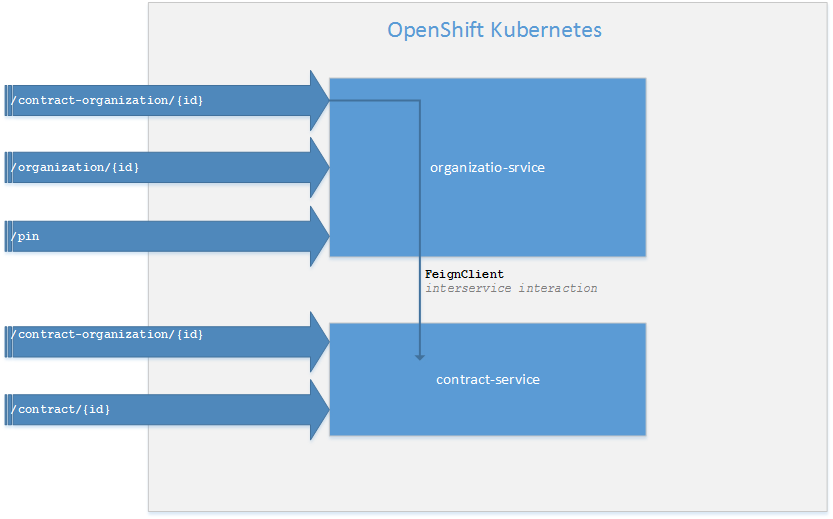
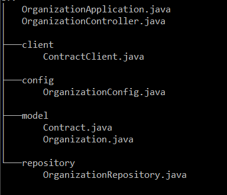
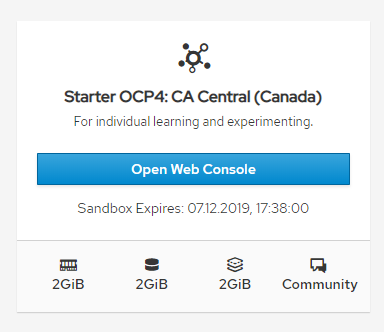
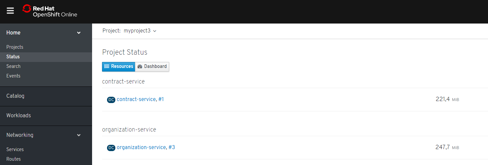
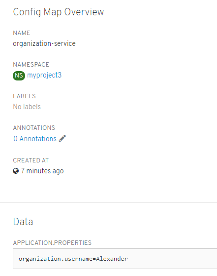
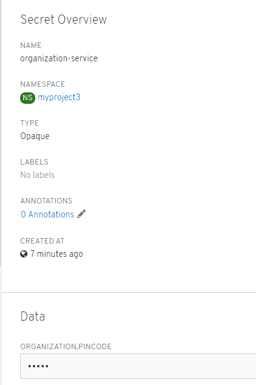
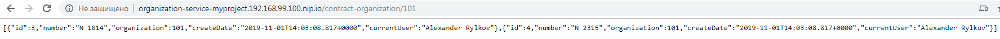

## Spring Qubernetes

Пример описывает следующие понятия
- Использование микро сервисной архитектуры в контейнере OpenShift (под управлением qubernetes)
- Межсервисное взаимодействие с использованием FeignClient и балансировки нагрузки Ribbon 
- Изменение конфигурации во время работы сервиса (ConfigMap)
- Использование конфигурации с защищенной информацией (Secret)

Схема сервисов и взаимодействия

Два сервиса organization-service и contract-service. Каждый из сервисов имеют по REST контролеру, репозиторию данных и модель данных. organization-service еще имеет bean конфигурации. 
Пример organization-service
  
  

Из organization-service есть доступ через FeignClient в contract-service. organization-service использует настройки из ConfigMap и Secret. Всякий раз когда обращаемся к «/contract-organization/{id}» - заполняется текущий пользователь из настройки ConfigMap, которут можно менять во время работы, а через запрос «/pin» можно получить доступ к secret настройки.  

Сервисы развернуты в среде Mishift локально и удаленно на реальном кластере OpenShift в Канаде.
 

Сервисы

Настройки сервиса organization-service

Secret настройка

Тестирование сервисов выполнялось из браузера или через “curl” .
Пример локального теста:
`G:\>curl http://contract-service-myproject.192.168.99.100.nip.io/contract/1
{"id":1,"number":"N 001","organization":100,"createDate":"2019-11-01T14:03:08.817+0000","currentUser":null}
` 
В браузере

На удаленном сервере:

URL для доступа к сервисам:
`http://organization-myproject3.apps.ca-central-1.starter.openshift-online.com/

http://contract-myproject3.apps.ca-central-1.starter.openshift-online.com/
`
Далее к ним можно выполнить REST запросы, пример:

Получить secret

`G:\>curl http://organization-myproject3.apps.ca-central-1.starter.openshift-online.com/pin

 ответ 654`

`G:\>curl http://organization-myproject3.apps.ca-central-1.starter.openshift-online.com/contract-organization/100

ответ

[{"id":1,"number":"N 001","organization":100,"createDate":"2019-11-02T14:38:30.751+0000","currentUser":"Alexander"},{"id":2,"number":"N 111","organization":100,
"createDate":"2019-11-02T14:38:30.751+0000","currentUser":"Alexander"}]
`

Здесь поле currentUser будет заполнено из ConfigMap

Команды для создания редактирования, настроек  

`oc create -f configmap.yml`

`oc create -f secret.yml`

`oc edit configmap organization-service`
